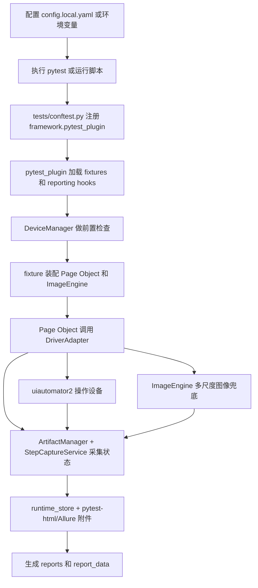

# Android UI 自动化框架

[](https://github.com/leaveeeeeee/ai-android-ui-autotest-framework/actions/workflows/pr-check.yml)
[](https://github.com/leaveeeeeee/ai-android-ui-autotest-framework/actions/workflows/docker-publish.yml)

这是一套基于 `pytest + Page Object + uiautomator2 + OpenCV` 的安卓 UI 自动化框架。当前仓库已经接好真机执行、结构化 HTML 报告、Allure 结果、文本生成用例和 Docker 依赖安装。

当前真机环境已验证通过的关键版本：

- `uiautomator2==3.4.1`

## 现在的目录更清晰了

```text
uiauto/
├── framework/
│   ├── core/
│   ├── device/
│   ├── generator/
│   ├── pages/
│   ├── reporting/
│   └── vision/
├── tests/
├── scripts/
├── docs/
├── config/
├── assets/
└── artifacts/
    ├── reports/
    └── report_data/
```

### 目录职责

- `framework/`: 真正的框架代码。以后看核心能力，直接进这里。
- `tests/`: pytest 用例、极薄的 `conftest.py` 注册入口，以及测试专用 fake/stub。
- `scripts/`: 运行用例、生成报告、生成文本用例等脚本。
- `docs/`: 接口说明、用例录入规范、GitHub 接入说明。
- `artifacts/reports/`: 只放最终可查看的报告入口和历史运行报告。
- `artifacts/report_data/`: 放生成报告所需的原始数据，比如截图、page source、日志、Allure 结果、调试图。

## 快速理解流程

高层流程图如下：



详细流程图见：

- [docs/framework_flow.md](docs/framework_flow.md)

## 报告怎么找

执行一套用例后，优先直接看：

- 总览入口：`artifacts/reports/index.html`
- 最新一次运行：`artifacts/reports/latest/index.html`
- 历史运行：`artifacts/reports/runs/<run_id>/index.html`
- 单用例详情：`artifacts/reports/latest/cases/<case_slug>/index.html`

报告里现在会展示：

- 整体用例数、通过数、失败数、成功率
- 单个用例执行结果、耗时、步骤数
- 每一步的截图、点击区域红框、前后截图对比图、差异图
- 每一步的日志、预期、实际、对比结果、当前焦点窗口
- 失败原因、失败截图、page source
- 所有截图、调试图、差异图都带 `run_id + case_name + step/index` 唯一命名，不会互相覆盖

`artifacts/report_data/` 里是原始生成数据，通常只在排障或二次分析时看。

## 当前框架能力

- 公共前置：执行前检查 ADB、设备状态、焦点窗口、输入法、屏幕状态，并按状态驱动恢复基线页
- 公共后置：执行后按状态收敛到统一初始状态，不再依赖固定 `sleep + back/home/back`
- 页面对象：业务语义方法集中在 `framework/pages/`
- 页面对象装配：fixture 优先显式注入 `ImageEngine`；`BasePage` 只保留兼容性回退
- 图像兜底：`Locator` 支持显式声明 `image_template / image_region / image_threshold`
- 图像兜底：`ImageEngine` 支持多尺度模板匹配，适配常见分辨率缩放
- 文本生成用例：支持 `csv/xlsx` 转 pytest；信息不完整时可同时产出 AI prompt，并自动清理当前输入源的过期生成文件
- 报告链路：结构化 HTML + `pytest-html` + Allure results；其中 `runtime_store` 主要服务结构化 HTML，另外两条链路通过 pytest hook 附件补充现场信息
- 内部拆分：`DriverAdapter` 仍是稳定 facade，采集逻辑已拆到 `ArtifactManager` 和 `StepCaptureService`
- 步骤 API：页面对象统一使用 `StepSpec + BasePage.step()`，避免业务方法里散落大量 `record_step(**kwargs)` 样板代码
- 执行边界：单 `serial` 真机语义，`device` 用例不支持 `pytest-xdist` 并行执行

## 快速开始

1. 安装依赖

```bash
python -m venv .venv
source .venv/bin/activate
python -m pip install -U pip
python -m pip install -e ".[dev]"
```

2. 初始化配置

```bash
cp config/config.example.yaml config/config.local.yaml
```

`config.local.yaml` 只放本机/本设备信息，不提交到仓库。常用配置也可以直接用环境变量覆盖：

```bash
ANDROID_SERIAL=xxx \
APP_PACKAGE=mark.via \
APP_ACTIVITY=.Shell \
BASELINE_URL=https://www.baidu.com \
REPORTS_ROOT=artifacts/reports \
IMAGE_THRESHOLD=0.92 \
pytest tests/test_via_baidu_search.py -m "smoke and device" --simple-html=artifacts/reports/via_baidu_report.html
```

3. 先跑纯单测

```bash
pytest tests -m "not device"
```

4. 运行当前真机示例

```bash
./scripts/run_via_baidu_report.sh
```

5. 打开报告

```text
artifacts/reports/index.html
```

6. 如果本机安装了 Allure CLI，再生成 Allure 静态页

```bash
./scripts/generate_allure_report.sh
```

7. 推荐顺手安装本地 git hooks

```bash
./scripts/install_git_hooks.sh
```

8. 本地快速失败时手动加 `--maxfail=1`，不要把它作为全局默认

```bash
pytest --maxfail=1 tests -m "not device"
```

Allure 原始结果会固定写到：

```text
artifacts/report_data/allure-results/
```

Allure HTML 页面会生成到：

```text
artifacts/report_data/allure-report/
```

## 当前真实业务示例

- 用例文件：[tests/test_via_baidu_search.py](tests/test_via_baidu_search.py)
- 页面对象：[framework/pages/via_baidu_page.py](framework/pages/via_baidu_page.py)
- 运行脚本：[scripts/run_via_baidu_report.sh](scripts/run_via_baidu_report.sh)

这个场景会通过 Via 浏览器打开 `https://www.baidu.com`，输入 `chatgpt`，点击搜索并校验结果页。

如果要跑真机用例，请保持单 worker。框架会在检测到 `device` 用例配合 `pytest-xdist` 时直接报错，避免多个 worker 争抢同一台设备。

## 文本生成用例

结构化文本直接生成：

```bash
python scripts/generate_cases_from_excel.py examples/case_inputs/test_cases_template.csv
```

如果录入文本缺少 `python_calls`，脚本会同时生成 AI prompt 到：

```text
artifacts/report_data/ai-prompts/
```

生成脚本会在 `tests/generated/.manifest/` 下维护当前输入源的 manifest，
下次再次生成时会自动清理这个输入源之前生成、但本次已经删除的旧 pytest 文件和 AI prompt。

相关文档：

- [docs/framework_api.md](docs/framework_api.md)
- [docs/framework_flow.md](docs/framework_flow.md)
- [docs/test_case_entry_standard.md](docs/test_case_entry_standard.md)
- [docs/case_generation_workflow.md](docs/case_generation_workflow.md)
- [docs/adr/0001-driver-facade-and-step-capture.md](docs/adr/0001-driver-facade-and-step-capture.md)
- [docs/upgrade_guide.md](docs/upgrade_guide.md)
- [docs/performance_baseline.md](docs/performance_baseline.md)

## Docker

仓库已经提供基础 [Dockerfile](Dockerfile)。

构建：

```bash
docker build -t android-ui-framework .
```

容器默认跑非真机测试；真机执行通过命令行参数显式传入。

真机运行建议显式挂载 artifacts，并通过环境变量传入设备/应用信息：

```bash
docker run --rm \
  -e ANDROID_SERIAL=xxx \
  -e APP_PACKAGE=mark.via \
  -e APP_ACTIVITY=.Shell \
  -v "$PWD/artifacts:/app/artifacts" \
  --network host \
  android-ui-framework \
  python -m pytest tests/test_via_baidu_search.py -m "smoke and device"
```

当前 GitHub Actions 会在 `main` 分支自动构建并发布 Docker 镜像到 GHCR：

```text
ghcr.io/leaveeeeeee/ai-android-ui-autotest-framework
```

## GitHub

当前仓库已经接好两条 GitHub Actions 流程：

- `PR Check`
  - 编译检查
  - 基础单测
  - 输出 coverage 摘要并上传 HTML/JUnit/Coverage 工件
- `Docker Publish`
  - `main` 分支通过后构建镜像
  - 发布到 GitHub Container Registry

具体说明看：

- [docs/github_setup.md](docs/github_setup.md)

## 关键文件入口

- 配置：[config/config.example.yaml](config/config.example.yaml)
- pytest 注册入口：[tests/conftest.py](tests/conftest.py)
- pytest 插件总入口：[framework/pytest_plugin.py](framework/pytest_plugin.py)
- fixture 定义：[framework/pytest_fixtures.py](framework/pytest_fixtures.py)
- 生命周期与失败采集：[framework/reporting/hooks.py](framework/reporting/hooks.py)
- Driver：[framework/core/driver.py](framework/core/driver.py)
- 步骤模型：[framework/core/steps.py](framework/core/steps.py)
- 设备管理：[framework/device/manager.py](framework/device/manager.py)
- 报告生成：[framework/reporting/simple_html.py](framework/reporting/simple_html.py)
- 图像匹配：[framework/vision/image_engine.py](framework/vision/image_engine.py)
