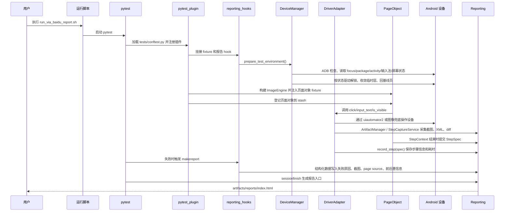
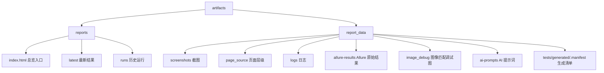

# 框架使用与执行流程图

这份文档面向第一次接触仓库的同事，重点回答两个问题：

- 这个框架平时该怎么用
- 一条真机用例从启动到产出报告，中间到底发生了什么

## 日常使用流程

```mermaid
flowchart TD
    A[准备配置文件 config/config.local.yaml] --> B[编写或生成测试用例]
    B --> C[执行脚本 scripts/run_via_baidu_report.sh]
    C --> D[pytest 加载 tests/conftest.py]
    D --> E[framework.pytest_plugin 注册 fixtures 和 hooks]
    E --> F[创建 config / device_manager / driver fixture]
    F --> G[真机前置检查]
    G --> H[fixture 装配 ImageEngine 并登记页面对象到 stash]
    H --> I[用例调用页面对象业务方法]
    I --> I2[BasePage.step / StepSpec 编排步骤]
    I2 --> J[DriverAdapter 统一等待/点击重试]
    J --> K{普通定位是否成功}
    K -- 是 --> L[uiautomator2 与设备交互]
    K -- 否且声明了图片兜底契约 --> M[ImageEngine 多尺度模板匹配]
    L --> N[ArtifactManager + StepCaptureService 采集状态]
    M --> N
    N --> O[record_step(spec) 写入步骤与 duration_ms]
    O --> P[hook 挂附件 + runtime_store 聚合]
    P --> Q[生成 HTML 报告和 Allure 结果]
```

## 真机用例执行链路



## 并行执行边界

- 纯单测可以使用 `pytest-xdist`
- 只要收集到 `@pytest.mark.device` 用例，框架会在 pytest 启动阶段直接拒绝 `-n/--numprocesses`
- 原因不是线程安全的小问题，而是当前框架以“单 serial、单设备”作为执行语义，多 worker 会争抢同一台真机

## 报告目录结构



## 推荐阅读顺序

1. 先看 [README.md](../README.md)
2. 再看 [docs/framework_api.md](framework_api.md)
3. 然后看 [docs/adr/0001-driver-facade-and-step-capture.md](adr/0001-driver-facade-and-step-capture.md)
4. 再看 [framework/pytest_plugin.py](../framework/pytest_plugin.py) 和 [framework/reporting/hooks.py](../framework/reporting/hooks.py)
5. 最后结合实际页面对象查看 [framework/pages/via_baidu_page.py](../framework/pages/via_baidu_page.py)
