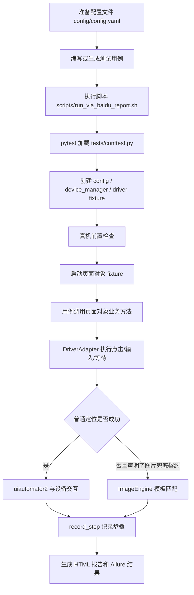
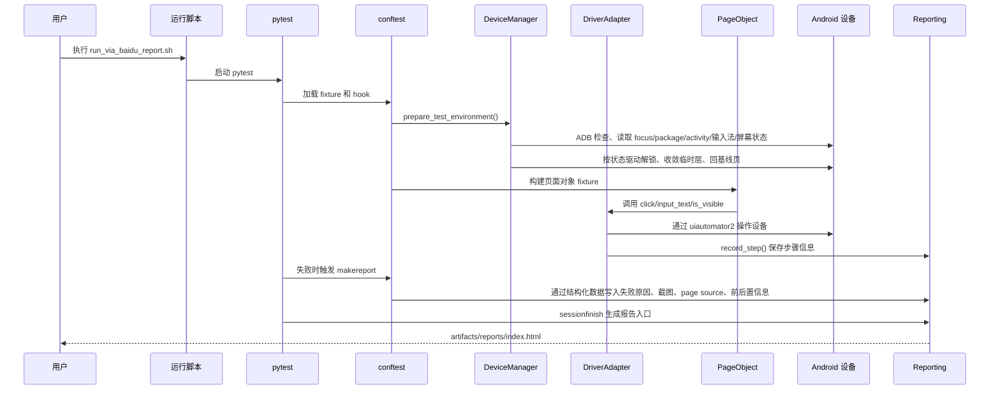
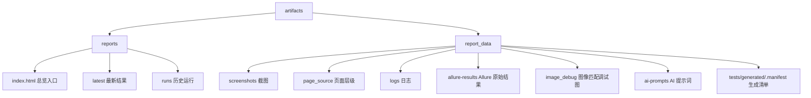

# 框架使用与执行流程图

这份文档面向第一次接触仓库的同事，重点回答两个问题：

- 这个框架平时该怎么用
- 一条真机用例从启动到产出报告，中间到底发生了什么

## 日常使用流程

## 真机用例执行链路

## 报告目录结构

## 推荐阅读顺序

1. 先看 [README.md](/Volumes/SD%20Card/从入门到%20recode/uiauto/README.md)
2. 再看 [docs/framework_api.md](/Volumes/SD%20Card/从入门到%20recode/uiauto/docs/framework_api.md)
3. 然后看 [tests/conftest.py](/Volumes/SD%20Card/从入门到%20recode/uiauto/tests/conftest.py)
4. 最后结合实际页面对象查看 [framework/pages/via_baidu_page.py](/Volumes/SD%20Card/从入门到%20recode/uiauto/framework/pages/via_baidu_page.py)
